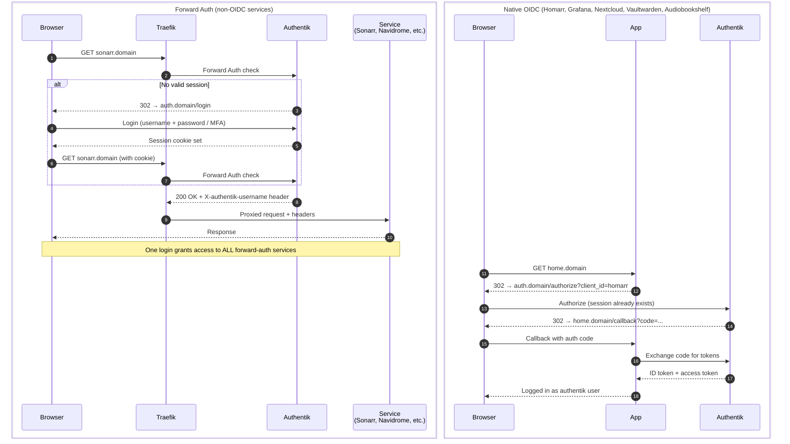
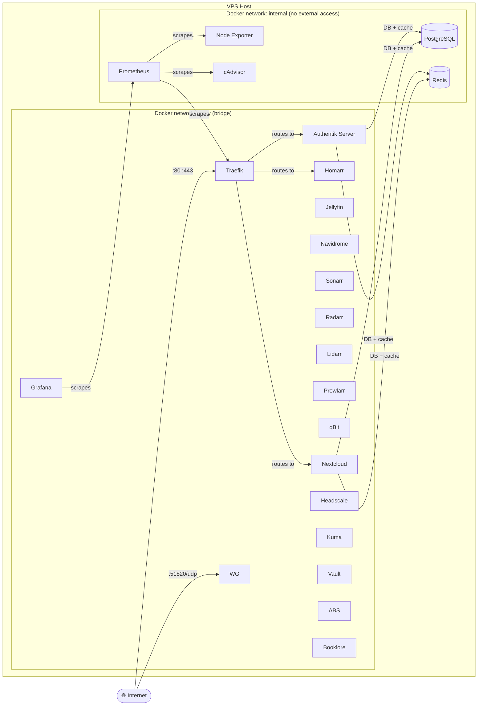

# Ultimate Self-Hosted Stack

A single-command installer that spins up 25+ self-hosted services on any Linux VPS, fully configured with SSL, SSO, and a unified home dashboard.

```bash
git clone https://github.com/MachineSaver/ultimate-self-hosted.git
cd ultimate-self-hosted
./install.sh
```

The installer walks you through a short set of prompts — admin credentials, domain, timezone, and optionally a Hetzner Storage Box for media — then generates all secrets, wires up SSO, pulls images, and starts the stack.

---

## Services

| Category | Service | URL | Auth Method | Notes |
|---|---|---|---|---|
| **Dashboard** | Homarr | `home.domain` | Native OIDC | |
| **Identity** | Authentik | `auth.domain` | — (is the IdP) | |
| **Media** | Jellyfin | `jellyfin.domain` | Forward Auth | |
| **Media** | Jellyseerr | `requests.domain` | Forward Auth | |
| **Media** | Audiobookshelf | `audiobooks.domain` | Native OIDC | |
| **Media** | Booklore | `books.domain` | Forward Auth | |
| **Media** | Navidrome | `music.domain` | Forward Auth | |
| **Automation** | Sonarr | `sonarr.domain` | Forward Auth |
| **Automation** | Radarr | `radarr.domain` | Forward Auth | |
| **Automation** | Lidarr | `lidarr.domain` | Forward Auth | |
| **Automation** | Prowlarr | `prowlarr.domain` | Forward Auth | |
| **Downloads** | qBittorrent | `qbit.domain` | Forward Auth | |
| **Cloud** | Nextcloud | `cloud.domain` | Native OIDC | |
| **VPN** | Headscale | `headscale.domain` | Forward Auth (UI) | |
| **VPN** | WireGuard Easy | `vpn.domain` | Forward Auth | |
| **Monitoring** | Uptime Kuma | `uptime.domain` | Forward Auth | |
| **Monitoring** | Grafana | `grafana.domain` | Native OIDC | |
| **Monitoring** | Prometheus | internal only | — | |
| **Security** | Vaultwarden | `vault.domain` | Native OIDC | |
| **Proxy** | Traefik Dashboard | `traefik.domain` | Forward Auth | |

---

## Architecture

### Traffic Flow

All traffic enters through Traefik, which terminates SSL and routes to the correct service. Every service sits behind authentication — either the service handles OIDC itself, or Traefik intercepts the request and validates the Authentik session before forwarding.


---

### SSO Authentication Flows

There are two authentication paths depending on whether a service supports OIDC natively.



---

### Docker Network Topology

Services are isolated into two networks. External traffic only reaches the `proxy` network. Databases are never exposed outside the `internal` network.



---

## Prerequisites

### Hetzner VPS

**Minimum specs:** CX32 (4 vCPU / 8 GB RAM) — the full stack needs headroom.

**Recommended OS:** Ubuntu 24.04 LTS

**Firewall rules** — configure in Hetzner Cloud Console before first boot:

| Protocol | Port | Source | Purpose |
|---|---|---|---|
| TCP | 22 | Your IP only | SSH |
| TCP | 80 | Anywhere | Let's Encrypt challenge |
| TCP | 443 | Anywhere | HTTPS |
| UDP | 51820 | Anywhere | WireGuard VPN |

Block all other inbound traffic.

### Hetzner Storage Box (optional)

The installer can mount a Hetzner Storage Box for all media and downloads, keeping large files off the VPS's local SSD. Service config data (Sonarr, Radarr, databases, etc.) stays on local storage where random I/O is fast.

**What goes where:**

| Storage | Content |
|---|---|
| Storage Box | `media/` and `downloads/` (movies, TV, music, books, podcasts) |
| VPS local SSD | Everything else — service configs, databases, Authentik, Nextcloud |

**Requirements:**

- A Hetzner Storage Box in the **same datacenter region** as your VPS (same-region access is via the internal network — fast and free of egress costs)
- **Samba/SMB access must be enabled** for the Storage Box in [Hetzner Robot](https://robot.hetzner.com) under the Storage Box settings — it is disabled by default
- TCP port 445 must not be blocked between the VPS and the Storage Box (it isn't by default on Hetzner's internal network)
- The installer must run as **root** to write `/etc/fstab` and the credentials file

The installer will:
1. Install `cifs-utils`
2. Write credentials to `/root/.storagebox-credentials` (chmod 600)
3. Mount the Storage Box at `/mnt/storagebox` (or a path you choose)
4. Create the media subdirectory structure on the box
5. Add an fstab entry with `_netdev` (waits for network) and `nofail` (never blocks boot if the box is unreachable)

**Boot-time behaviour:** Every time you start the stack via `./scripts/start.sh`, it checks whether the Storage Box is mounted and readable. If it is not, it attempts a remount. If that also fails, it prints a warning and falls back to local storage so services still come up — you just won't see the remote media until the box is remounted and the stack is restarted.

### DNS Records

Add an A record for each subdomain pointing to your VPS IP **before running the installer** — Traefik needs them to provision SSL certificates.

```
A  home.yourdomain.com        →  <VPS IP>
A  auth.yourdomain.com        →  <VPS IP>
A  jellyfin.yourdomain.com    →  <VPS IP>
A  requests.yourdomain.com    →  <VPS IP>
A  audiobooks.yourdomain.com  →  <VPS IP>
A  books.yourdomain.com       →  <VPS IP>
A  music.yourdomain.com       →  <VPS IP>
A  sonarr.yourdomain.com      →  <VPS IP>
A  radarr.yourdomain.com      →  <VPS IP>
A  lidarr.yourdomain.com      →  <VPS IP>
A  prowlarr.yourdomain.com    →  <VPS IP>
A  qbit.yourdomain.com        →  <VPS IP>
A  cloud.yourdomain.com       →  <VPS IP>
A  headscale.yourdomain.com   →  <VPS IP>
A  vpn.yourdomain.com         →  <VPS IP>
A  uptime.yourdomain.com      →  <VPS IP>
A  grafana.yourdomain.com     →  <VPS IP>
A  vault.yourdomain.com       →  <VPS IP>
A  traefik.yourdomain.com     →  <VPS IP>
```

Verify propagation before proceeding: `dig home.yourdomain.com`

---

## Installation

### Step 1 — Prepare the VPS

SSH in as root, then run:

```bash
# Update system
apt update && apt upgrade -y

# Create a non-root user
adduser youruser
usermod -aG sudo youruser

# Copy SSH key to new user
rsync --archive --chown=youruser:youruser ~/.ssh /home/youruser

# Disable root login and password auth
sed -i 's/^#\?PermitRootLogin.*/PermitRootLogin no/' /etc/ssh/sshd_config
sed -i 's/^#\?PasswordAuthentication.*/PasswordAuthentication no/' /etc/ssh/sshd_config
systemctl restart sshd

# Install Docker
curl -fsSL https://get.docker.com | sh
usermod -aG docker youruser

# Install git
apt install -y git
```

Log out and SSH back in as `youruser` (not root) for all remaining steps.

### Step 2 — Clone and Run

```bash
git clone https://github.com/MachineSaver/ultimate-self-hosted.git
cd ultimate-self-hosted
./install.sh
```

> **Note for Storage Box users:** if you plan to mount a Hetzner Storage Box, run `install.sh` as root (or with `sudo`). The installer writes to `/etc/fstab` and `/root/.storagebox-credentials`, which require root. For local-storage-only installs a regular user in the `docker` group is sufficient.

The installer will prompt for:

| Prompt | Default | Notes |
|---|---|---|
| Admin username | — | Used as the login across all services |
| Admin password | — | Stored in `.env` (never committed); must be strong |
| Domain | — | e.g. `example.com` — no `https://` |
| Admin email | `admin@<domain>` | Used by Authentik and Let's Encrypt |
| Timezone | `America/New_York` | [TZ database name](https://en.wikipedia.org/wiki/List_of_tz_database_time_zones) |
| Media directory | `./data/media` | Ignored if you choose a Storage Box |
| PUID / PGID | `1000` / `1000` | Run `id` on the VPS to get your values |
| Use Hetzner Storage Box? | `N` | If yes: hostname, username, password, SMB share name, mount point |
| SMB share name | `backup` | Hetzner's default share name for the main account; sub-users use their sub-user name |

The installer generates all secrets, processes config templates, pulls images, and starts the stack. First run takes 5–10 minutes.

The installer also handles these automatically so you don't have to:
- **Authentik admin username** — renamed from `akadmin` to whatever you entered, via the Authentik API immediately after first boot
- **ARR authentication** — Sonarr, Radarr, Lidarr, and Prowlarr are pre-configured with `External` auth so Authentik forward auth is the only gate; no second login screen

After the initial run, `scripts/start.sh` is generated in the project directory. Use it for all subsequent starts — it checks the Storage Box mount health before bringing containers up.

### Step 3 — First-boot checklist

The installer prints this checklist at the end. Work through it top to bottom.

**Run once:**
```bash
# Configure Nextcloud OIDC (installs and wires up the user_oidc app)
./scripts/configure-nextcloud-oidc.sh
```

**Services with a first-run wizard — complete before using:**

| Service | URL | What to do |
|---|---|---|
| Jellyfin | `jellyfin.domain` | Complete setup wizard; add media libraries |
| Jellyseerr | `requests.domain` | Connect to Jellyfin in setup wizard |
| Uptime Kuma | `uptime.domain` | Create admin account on first visit |
| Audiobookshelf | `audiobooks.domain` | Settings → Authentication → enable OpenID Connect. Issuer: `https://auth.domain/application/o/audiobookshelf/`. Client ID and secret are in `.env` as `AUDIOBOOKSHELF_OIDC_CLIENT_ID` / `AUDIOBOOKSHELF_OIDC_CLIENT_SECRET` |

**Services with a separate login (by design):**

| Service | Credential |
|---|---|
| qBittorrent | Temporary password — `docker compose logs qbittorrent \| grep -i "temporary password"` |
| WireGuard Easy | Auto-configured with your install credentials (admin username + password) |

**Headscale** — register your first user and generate a pre-auth key:
```bash
docker compose exec headscale headscale users create youruser
docker compose exec headscale headscale preauthkeys create --user youruser --reusable --expiration 24h
```

Then on any device with the Tailscale client:
```bash
tailscale login --login-server https://headscale.yourdomain.com
```

**Vaultwarden admin panel** — accessible at `https://vault.yourdomain.com/admin` using the `AUTHENTIK_BOOTSTRAP_TOKEN` value from `.env`.

---

## Operations

### Starting the stack

Always use `scripts/start.sh` rather than `docker compose up -d` directly. It verifies (and if needed remounts) the Storage Box before bringing containers up, so the correct media paths are in place. If you used local storage only, it works identically.

```bash
./scripts/start.sh
```

### Day-to-day commands

```bash
# View all running containers
docker compose ps

# Follow logs for a service
docker compose logs -f authentik-server

# Restart a single service
docker compose restart sonarr

# Pull latest images and redeploy
docker compose pull && ./scripts/start.sh

# Stop everything
docker compose down

# Stop everything and remove volumes (DESTRUCTIVE — deletes all data)
docker compose down -v
```

### Storage Box — manual remount

If the Storage Box becomes unavailable while the stack is running and you want to restore it without a full restart:

```bash
# Remount the Storage Box
mount /mnt/storagebox        # path you chose during install

# Restart only the media-facing services
docker compose restart jellyfin audiobookshelf navidrome sonarr radarr lidarr qbittorrent
```

Or do a clean restart via `./scripts/start.sh`, which re-checks the mount automatically.

---

## Troubleshooting

**SSL certificates not provisioning**
DNS records must resolve to the VPS before Traefik can complete the ACME HTTP challenge. Fix DNS, then:
```bash
docker compose restart traefik
```

**Authentik not starting**
It takes ~90 seconds on first boot while it runs database migrations. Check:
```bash
docker compose logs -f authentik-server
```

**Service unreachable after login**
The Authentik embedded outpost needs to be configured with your domain. Verify the blueprint was applied in Authentik → System → Blueprints. If it shows an error, check:
```bash
docker compose logs authentik-worker
```

**qBittorrent login loop**
The Web UI has a security feature that rejects requests where the `Host` header doesn't match. Ensure the `qbit-headers` Traefik middleware is active and restart the container.

**Nextcloud "untrusted domain" error**
The `NEXTCLOUD_TRUSTED_DOMAINS` env var in `docker-compose.yml` must match your domain exactly. Update `.env` and run `docker compose up -d nextcloud`.

**Storage Box unavailable / media missing**
If services start but show no media, the Storage Box likely failed to mount and the stack fell back to local storage. Check the output of `./scripts/start.sh` for the warning message. To recover:

```bash
# Check whether it's mounted
mountpoint /mnt/storagebox

# Remount manually
mount /mnt/storagebox

# If that fails, check connectivity and credentials
mount -v /mnt/storagebox

# Restart the stack so containers pick up the storage box paths
docker compose down && ./scripts/start.sh
```

The credentials file is at `/root/.storagebox-credentials`. The fstab entry added during install uses `nofail`, so a missing Storage Box will never prevent the VPS from booting — the stack just falls back silently.

---

## Security Notes

- `.env` contains all secrets and is excluded from git via `.gitignore` — never commit it
- PostgreSQL and Redis are on the `internal` Docker network and not reachable from outside
- Prometheus, cAdvisor, and Node Exporter are internal only — Grafana queries them internally
- Signups are disabled on Vaultwarden (`SIGNUPS_ALLOWED=false`) — invite users from the admin panel
- Traefik dashboard is protected by Authentik forward auth

---

## License

MIT
