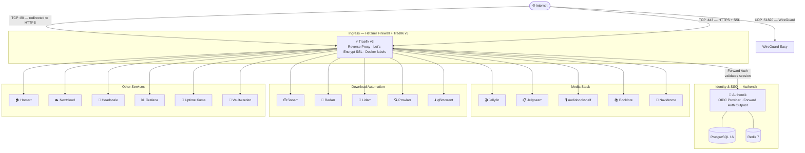
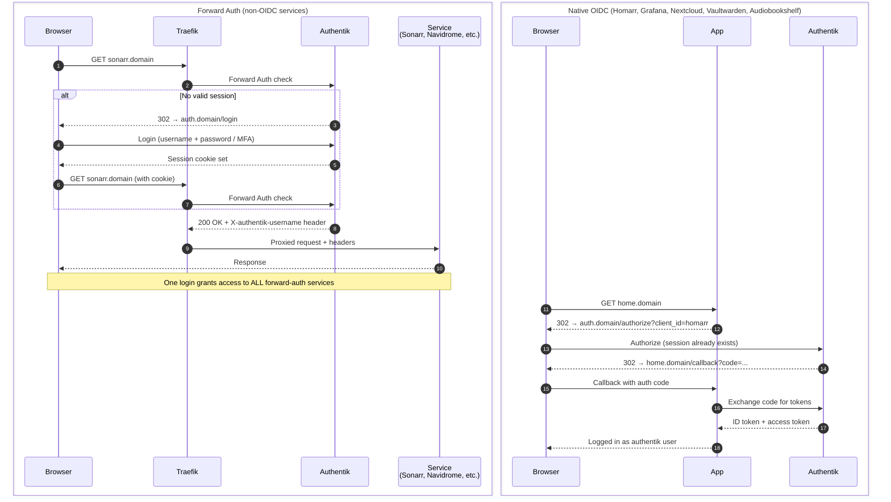

# Ultimate Self-Hosted Stack

A single-command installer that spins up 20+ self-hosted services on any Linux VPS, fully configured with SSL, SSO, and a unified home dashboard.

```bash
git clone https://github.com/MachineSaver/ultimate-self-hosted.git
cd ultimate-self-hosted
./install.sh
```

You will be asked for three things: an admin username, a password, and your domain. Everything else is automated.

---

## Services

| Category | Service | URL | Auth Method |
|---|---|---|---|
| **Dashboard** | Homarr | `home.domain` | Native OIDC |
| **Identity** | Authentik | `auth.domain` | — (is the IdP) |
| **Media** | Jellyfin | `jellyfin.domain` | Forward Auth |
| **Media** | Jellyseerr | `requests.domain` | Forward Auth |
| **Media** | Audiobookshelf | `audiobooks.domain` | Native OIDC |
| **Media** | Booklore | `books.domain` | Forward Auth |
| **Media** | Navidrome | `music.domain` | Forward Auth |
| **Automation** | Sonarr | `sonarr.domain` | Forward Auth |
| **Automation** | Radarr | `radarr.domain` | Forward Auth |
| **Automation** | Lidarr | `lidarr.domain` | Forward Auth |
| **Automation** | Prowlarr | `prowlarr.domain` | Forward Auth |
| **Downloads** | qBittorrent | `qbit.domain` | Forward Auth |
| **Cloud** | Nextcloud | `cloud.domain` | Native OIDC |
| **VPN** | Headscale | `headscale.domain` | Forward Auth (UI) |
| **VPN** | WireGuard Easy | `vpn.domain` | Forward Auth |
| **Monitoring** | Uptime Kuma | `uptime.domain` | Forward Auth |
| **Monitoring** | Grafana | `grafana.domain` | Native OIDC |
| **Monitoring** | Prometheus | internal only | — |
| **Security** | Vaultwarden | `vault.domain` | Native OIDC |
| **Proxy** | Traefik Dashboard | `traefik.domain` | Forward Auth |

---

## Architecture

### Traffic Flow

All traffic enters through Traefik, which terminates SSL and routes to the correct service. Every service sits behind authentication — either the service handles OIDC itself, or Traefik intercepts the request and validates the Authentik session before forwarding.



---

### SSO Authentication Flows

There are two authentication paths depending on whether a service supports OIDC natively.



---

### Docker Network Topology

Services are isolated into two networks. External traffic only reaches the `proxy` network. Databases are never exposed outside the `internal` network.


---

## Prerequisites

### Hetzner VPS

**Minimum specs:** CX32 (4 vCPU / 8 GB RAM) — the full stack needs headroom.

**Recommended OS:** Ubuntu 24.04 LTS

**Firewall rules** — configure in Hetzner Cloud Console before first boot:

| Protocol | Port | Source | Purpose |
|---|---|---|---|
| TCP | 22 | Your IP only | SSH |
| TCP | 80 | Anywhere | Let's Encrypt challenge |
| TCP | 443 | Anywhere | HTTPS |
| UDP | 51820 | Anywhere | WireGuard VPN |

Block all other inbound traffic.

### DNS Records

Add an A record for each subdomain pointing to your VPS IP **before running the installer** — Traefik needs them to provision SSL certificates.

```
A  home.yourdomain.com        →  <VPS IP>
A  auth.yourdomain.com        →  <VPS IP>
A  jellyfin.yourdomain.com    →  <VPS IP>
A  requests.yourdomain.com    →  <VPS IP>
A  audiobooks.yourdomain.com  →  <VPS IP>
A  books.yourdomain.com       →  <VPS IP>
A  music.yourdomain.com       →  <VPS IP>
A  sonarr.yourdomain.com      →  <VPS IP>
A  radarr.yourdomain.com      →  <VPS IP>
A  lidarr.yourdomain.com      →  <VPS IP>
A  prowlarr.yourdomain.com    →  <VPS IP>
A  qbit.yourdomain.com        →  <VPS IP>
A  cloud.yourdomain.com       →  <VPS IP>
A  headscale.yourdomain.com   →  <VPS IP>
A  vpn.yourdomain.com         →  <VPS IP>
A  uptime.yourdomain.com      →  <VPS IP>
A  grafana.yourdomain.com     →  <VPS IP>
A  vault.yourdomain.com       →  <VPS IP>
A  traefik.yourdomain.com     →  <VPS IP>
```

Verify propagation before proceeding: `dig home.yourdomain.com`

---

## Installation

### Step 1 — Prepare the VPS

SSH in as root, then run:

```bash
# Update system
apt update && apt upgrade -y

# Create a non-root user
adduser youruser
usermod -aG sudo youruser

# Copy SSH key to new user
rsync --archive --chown=youruser:youruser ~/.ssh /home/youruser

# Disable root login and password auth
sed -i 's/^#\?PermitRootLogin.*/PermitRootLogin no/' /etc/ssh/sshd_config
sed -i 's/^#\?PasswordAuthentication.*/PasswordAuthentication no/' /etc/ssh/sshd_config
systemctl restart sshd

# Install Docker
curl -fsSL https://get.docker.com | sh
usermod -aG docker youruser

# Install git
apt install -y git
```

Log out and SSH back in as `youruser` (not root) for all remaining steps.

### Step 2 — Clone and Run

```bash
git clone https://github.com/MachineSaver/ultimate-self-hosted.git
cd ultimate-self-hosted
./install.sh
```

The installer will prompt for:
- **Admin username** — used across all services
- **Admin password** — must be strong; stored in `.env` (never committed)
- **Domain** — e.g. `example.com` (no `https://`)

It will then generate all secrets, build config files from templates, pull images, and start the stack. First run takes 5–10 minutes.

### Step 3 — Post-Boot Configuration

Run these after the stack is up. Allow 2–3 minutes for all services to initialize.

**Nextcloud OIDC** (installs and configures the `user_oidc` app automatically):
```bash
./scripts/configure-nextcloud-oidc.sh
```

**ARR services** — in each of Sonarr, Radarr, Lidarr, Prowlarr:
> Settings → General → Authentication → **External (Reverse Proxy)**

This removes the double-login since Authentik forward auth already protects the route.

**qBittorrent** — the temporary admin password is printed in the logs on first boot:
```bash
docker compose logs qbittorrent | grep -i "temporary password"
```

**Headscale** — register your first user and generate a pre-auth key:
```bash
# Create a user
docker compose exec headscale headscale users create youruser

# Generate a reusable key for device enrollment
docker compose exec headscale headscale preauthkeys create --user youruser --reusable --expiration 24h
```

Then on any device with the Tailscale client:
```bash
tailscale login --login-server https://headscale.yourdomain.com
```

**Vaultwarden admin panel** — accessible at `https://vault.yourdomain.com/admin` using the `AUTHENTIK_BOOTSTRAP_TOKEN` value from `.env`.

---

## Operations

```bash
# View all running containers
docker compose ps

# Follow logs for a service
docker compose logs -f authentik-server

# Restart a single service
docker compose restart sonarr

# Pull latest images and redeploy (zero-downtime for most services)
docker compose pull && docker compose up -d

# Stop everything
docker compose down

# Stop everything and remove volumes (DESTRUCTIVE — deletes all data)
docker compose down -v
```

---

## Troubleshooting

**SSL certificates not provisioning**
DNS records must resolve to the VPS before Traefik can complete the ACME HTTP challenge. Fix DNS, then:
```bash
docker compose restart traefik
```

**Authentik not starting**
It takes ~90 seconds on first boot while it runs database migrations. Check:
```bash
docker compose logs -f authentik-server
```

**Service unreachable after login**
The Authentik embedded outpost needs to be configured with your domain. Verify the blueprint was applied in Authentik → System → Blueprints. If it shows an error, check:
```bash
docker compose logs authentik-worker
```

**qBittorrent login loop**
The Web UI has a security feature that rejects requests where the `Host` header doesn't match. Ensure the `qbit-headers` Traefik middleware is active and restart the container.

**Nextcloud "untrusted domain" error**
The `NEXTCLOUD_TRUSTED_DOMAINS` env var in `docker-compose.yml` must match your domain exactly. Update `.env` and run `docker compose up -d nextcloud`.

---

## Security Notes

- `.env` contains all secrets and is excluded from git via `.gitignore` — never commit it
- PostgreSQL and Redis are on the `internal` Docker network and not reachable from outside
- Prometheus, cAdvisor, and Node Exporter are internal only — Grafana queries them internally
- Signups are disabled on Vaultwarden (`SIGNUPS_ALLOWED=false`) — invite users from the admin panel
- Traefik dashboard is protected by Authentik forward auth

---

## License

MIT
